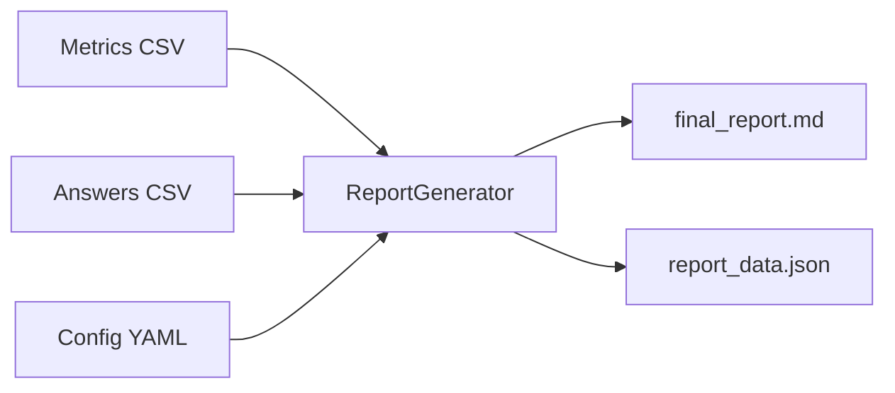

# Reporting Engine

[Русский](README.ru.md)

Reporting engine for VLMHyperBench. Generates Markdown and JSON reports from evaluation results.

## Data Flow



## Installation

```bash
pip install -e .
```

## Usage

```python
from reporting import ReportGenerator