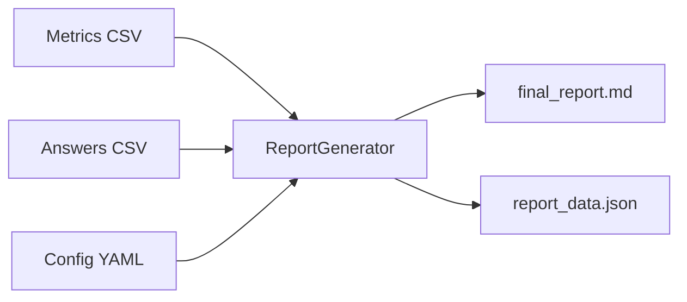

# Reporting Engine (Движок отчетов)

[English](README.md)

Модуль генерации отчетов для VLMHyperBench. Создает отчеты в форматах Markdown и JSON на основе результатов оценки.

## Поток данных (Data Flow)



## Установка

```bash
pip install -e .
```

## Использование

```python
from reporting import ReportGenerator